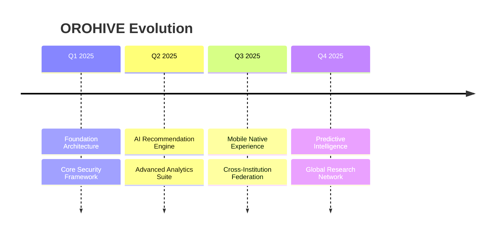

<div align="center">

# ⎈ **NatechDevs** ⎈
### *Strategic Innovation Architect & AI Systems Engineer*

[](https://git.io/typing-svg)

---


---

</div>

## ⚡ **Executive Profile**

```yaml
identity:
  name: "James Darrol Nate"
  alias: "NatechDevs"
  role: "Strategic Innovation Architect & AI Systems Designer"
  domain: "Enterprise Technology & Digital Transformation"

core_expertise:
  - Artificial Intelligence & Machine Learning Systems
  - Strategic Innovation & Technology Architecture
  - Automation & Intelligent Workflow Engineering
  - Data Analytics & Predictive Intelligence
  - Digital Transformation Leadership

mission_statement: >
  "Designing AI-augmented ecosystems that redefine how institutions
  operate, learn, and scale. Bridging strategic vision with
  technical execution to build the next generation of intelligent
  enterprise solutions."

current_focus:
  - OROHIVE: AI-Powered Enterprise E-Library Ecosystem
  - Intelligent Automation Frameworks for Education
  - Predictive Analytics & Data-Driven Decision Systems
```

---

## 🧠 **AI & Automation Intelligence**

<div align="center">

| Domain | Specialization | Impact |
|:------|:---------------|:-------|
| **Machine Learning** | Predictive Models, Pattern Recognition, Anomaly Detection | Data-driven decision intelligence |
| **Automation Engineering** | Workflow Automation, Process Optimization, CI/CD Pipelines | 10x operational efficiency |
| **Intelligent Systems** | AI-Augmented Platforms, Smart Recommendations, Adaptive UX | Personalized user experiences |
| **Data Analytics** | Real-time Dashboards, Behavioral Analytics, Performance Metrics | Actionable business insights |
| **System Architecture** | Scalable Microservices, API-First Design, Cloud-Native Infrastructure | Enterprise-grade reliability |

</div>

---

## 🏛️ **Strategic Skills Framework**

<div align="center">

### **Leadership & Strategy**


### **Technology Architecture**


### **Engineering Excellence**


</div>

---

## 🌐 **Technology Ecosystem**

<div align="center">

| Layer | Technologies |
|:------|:-------------|
| **Core Systems** | `PHP` `JavaScript` `Python` `SQL` `Bash` |
| **Frontend** | `GSAP` `ScrollTrigger` `TailwindCSS` `Bootstrap` `ApexCharts` |
| **Backend** | `REST APIs` `PDO` `MySQL` `Session Management` `Rate Limiting` |
| **Security** | `CSRF` `XSS Prevention` `SQL Injection Defense` `CSP` `HSTS` `SRI` |
| **Tools** | `Git` `GitHub` `VSCode` `XAMPP` `Postman` |
| **Design** | `Figma` `SVG` `Responsive Design` `Dark/Light Themes` |

</div>

---

## 📊 **GitHub Analytics Dashboard**

<div align="center">

<a href="https://github.com/NatechDevs">
  
  
</a>

<br>

<a href="https://github.com/NatechDevs">
  
</a>

<br>

<a href="https://github.com/NatechDevs">
  
</a>

</div>

---

## 🚀 **Featured Innovation**

<div align="center">

## **OROHIVE** │ *Enterprise E-Library Intelligence Platform*

[]()
[]()

```diff
+ Enterprise-grade architecture with AI-augmented intelligence
+ Multi-tenant school management system
+ Real-time analytics & visitor tracking
+ Role-based access control (Admin / Superadmin / IT Admin)
+ Secure passcode & token-based document delivery
+ GSAP-powered immersive user experiences
+ Rate-limited API layer with CSRF & XSS protection
```

</div>

---

## 💡 **Thought Leadership**

```javascript
const philosophy = {
  innovation: "Technology should amplify human potential, not replace it.",
  engineering: "Enterprise systems require defense-in-depth — security isn't a feature, it's a foundation.",
  leadership: "The best architecture anticipates problems before they exist.",
  vision: "Education technology must bridge accessibility with sophistication.",
  design: "Great systems are invisible — they work so well, users forget they're there."
};
```

---

## 📡 **Digital Footprint & Connect**

<div align="center">

[]()
[]()
[](mailto:jamesdarrolnate@devs.com)
[](https://github.com/NatechDevs)

</div>

---

## 🏆 **Professional Milestones**

<div align="center">

| Milestone | Achievement |
|:----------|:------------|
| 🎯 **OROHIVE v1.0** | Enterprise E-Library Platform deployed with full security audit |
| 🔐 **Security Architecture** | Implemented enterprise-grade CSRF, CSP, HSTS, SRI, rate limiting |
| 🎨 **UI/UX Innovation** | GSAP-powered immersive animations with ScrollTrigger |
| 🏢 **Multi-Tenant System** | School-level tenancy with role-based access control |
| 📊 **Intelligent Analytics** | Real-time visitor tracking, download metrics, performance dashboards |
| 🛡️ **Zero SQL Injection** | PDO parameterized queries throughout the entire codebase |

</div>

---

## 🗺️ **Innovation Roadmap**



---

<div align="center">

### *"Engineering intelligence. Architecting impact."*

---


**© 2025 NatechDevs. All Rights Reserved.**

</div>
